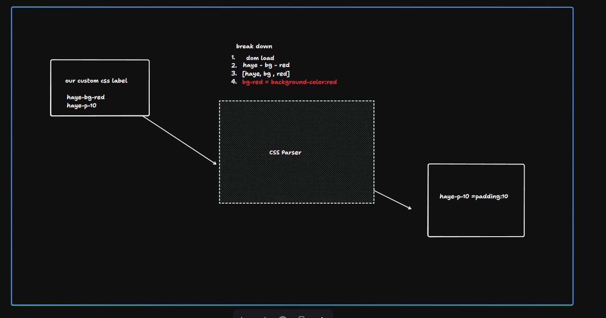

# HayeCSS 🚀

[](https://hayecss.netlify.app/)



**v1.0 is now live!**  
**No more CSS fear.**

The ultimate Tailwind alternative, perfectly tuned for backend developers who want to build beautiful landing pages without learning CSS.

---

## Quick Start

Install the package:
```bash
npm install hayecss
```

If you are using React (or Next.js), you can initialize the CSS engine once within a `useEffect`:

```javascript
import { useEffect } from "react";
import { applyHaye } from "hayecss";

export default function App() {
  useEffect(() => {
    applyHaye();
  }, []);

  return (
    <div className="haye-bg-secondary haye-h-screen haye-flex haye-items-center haye-justify-center">
      <h1 className="haye-text-3xl haye-text-primary haye-font-bold">
        Backend Devs ❤️ HayeCSS
      </h1>
    </div>
  );
}
```

## How to use HayeCSS Utilities

HayeCSS maps common styling requirements to intuitive prefixes. Just assign classes directly to your markup:

- **Backgrounds**: `haye-bg-primary`, `haye-bg-secondary`
- **Text & Formatting**: `haye-text-xl`, `haye-text-muted`, `haye-font-bold`
- **Spacing**: `haye-p-20`, `haye-m-10`, `haye-px-40`, `haye-gap-20`
- **Layouts**: `haye-flex`, `haye-flex-col`, `haye-justify-between`, `haye-items-center`

That's it. Nothing to compile. No massive CSS bundles to sift through.  
Just simple, predictable utility classes. Start building!
